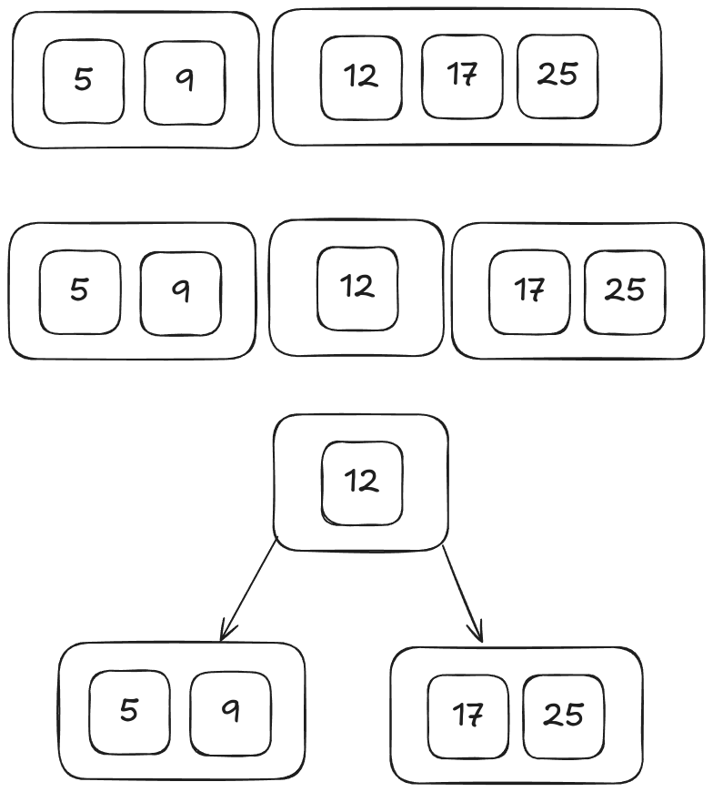

# BTree Implementation In Go

A B-tree is a self-balancing tree data structure that maintains sorted data and allows searches, sequential access, insertions, and deletions in logarithmic time.

## Insert Node

B-Tree has some initials definiitions, such as:
- The minimun amout of items that a node can have is half of the maximum, except for the root node

Let's assume the maximum items in node is 4 (four)

## Deleting Node

