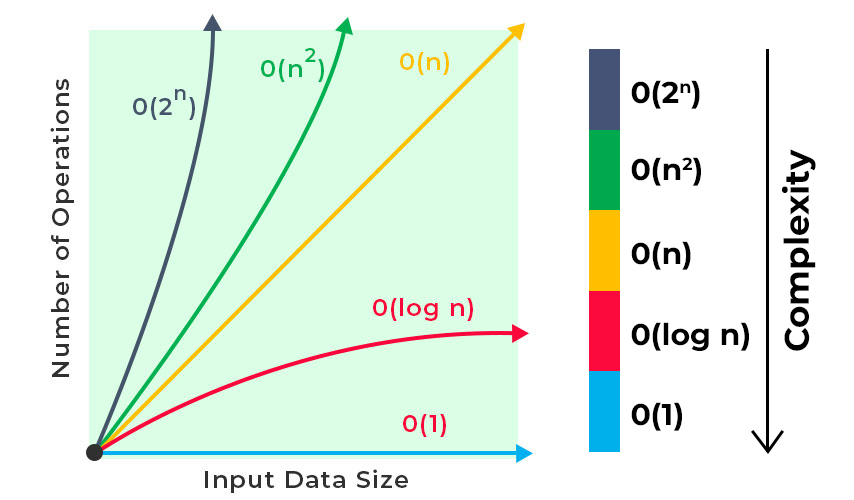
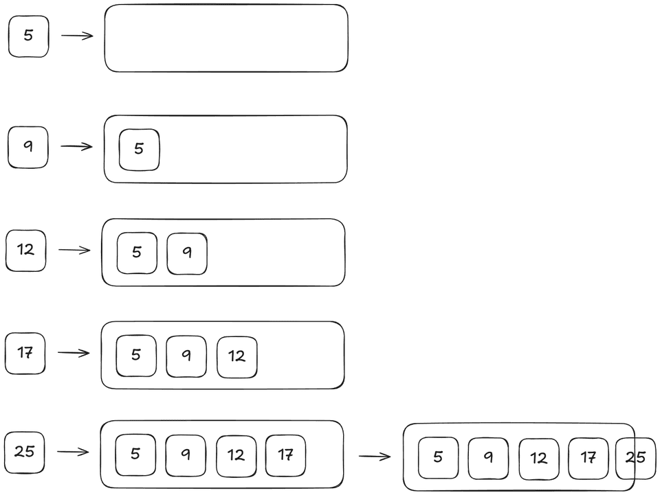
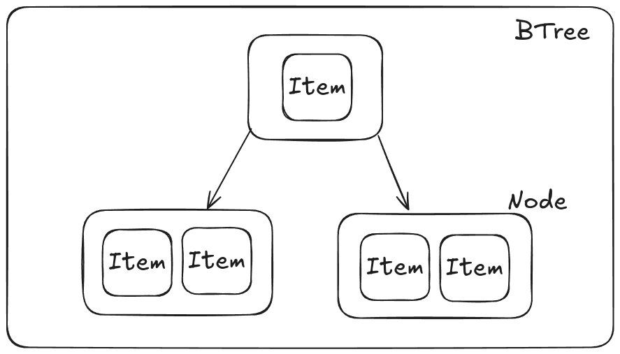

# BTree Implementation In Go

A B-tree is a self-balancing tree data structure that maintains sorted data and allows searches, sequential access, insertions, and deletions in logarithmic time.




### Introduction

B-Tree has some initials definiitions, such as:
- The minimun amout of items that a node can have is half of the maximum, except for the root node

Let's assume the maximum items in node is 4 (four)



So, what we need to do now, that there's 5 items within this node? We should split them up! We basically get the mid item, and make him the current root node, all from the left is going to point to him, and the same from the right.


So, with this introduction, we should be able to start our code!

```go
const (
	degree      = 5
	maxChildren = 2 * degree
	maxItems    = maxChildren - 1
	minItems    = degree - 1
)

type Item struct {
	Key []byte
	Val []byte
}

type Node struct {
	Items       [maxItems]*Item
	Children    [maxChildren]*Node
	NumItems    int
	NumChildren int
}

type BTree struct {
	root *Node
}
```

- Item is our smallest unit of data, it will store whatever you want
- Node is responsible to store our items
- BTree is de Data Structure that will arrange all nodes



## Searching Node

Before we dive into how to insert and delete node, there's one step earlier, that is implement how we're going to iterate over the btree.

```go
func (n *Node) search(key []byte) (int, bool) {
	low, high := 0, n.NumItems
	var mid int
	for low < high {
		mid = (low + high) / 2
		cmp := bytes.Compare(key, n.Items[mid].Key)
		switch {
		case cmp > 0:
			low = mid + 1
		case cmp < 0:
			high = mid
		case cmp == 0:
			return mid, true
		}
	}
	return low, false
}
```

This method performs a binary search on a sorted list of items inside a Node. It finds the position of a given key or determines where it should be inserted.

## Inserting Node

Let's start by create the implementation for our btree, that is kind simple, for now.

```go
func (b *BTree) Insert(key []byte, val []byte) bool {
	item := &Item{
		Key: key,
		Val: val,
	}

    // If there's no node, so it's the first insertion
	if b.root == nil {
		b.root = &Node{}
	}

	hasSuccess := b.root.insert(item)
	return hasSuccess
}

func (n *Node) insert(item *Item) bool {
	// Search into the files to see if found the item with the key provided
	pos, found := n.search(item.Key)

	// Found an item with the same key, so we must update this position with the new item
	if found {
		n.Items[pos] = item
		return false
	}
	return true
}
```

For the `Insert` BTree method is just instantiating the `Item` Object and Node `insert` method is appending into the root node. But this is just the beggning, what about the current Node is already fullfill? we need to split them up!

Let's begin with the current node has reached his limit:
```go
func (n *Node) insert(item *Item) bool {
	// Search into the files to see if found the item with the key provided
	pos, found := n.search(item.Key)

	// Found an item with the same key, so we must update this position with the new item
	if found {
		n.Items[pos] = item
		return false
	}

	// The node is already full
	if n.Children[pos].NumItems >= maxItems {
		// ....
	}

	return true
}
```

So we must implement our logic that will separate the node!
```go
func (n *Node) split() (*Item, *Node) {
	mid := minItems
	midItem := n.Items[mid]

	newNode := &Node{}
	copy(newNode.Items[:], n.Items[mid+1:])
	newNode.NumItems = minItems

	if !n.IsLeaf() {
		copy(newNode.Children[:], n.Children[mid+1:])
		newNode.NumChildren = minItems + 1
	}

	for i, l := mid, n.NumItems; i < l; i++ {
		n.Items[i] = nil
		n.NumItems--

		if !n.IsLeaf() {
			n.Children[i+1] = nil
			n.NumChildren--
		}
	}

	return midItem, newNode
}
```

- `mid` and `midItem` is getting the mid item within the current node.
- In `&Node{}` we `copy` half right of the item to inside the new node.
- If the node is not a leaf it copies the right half of the child pointers to `newNode.Children`

As you can see, we're calling the `IsLeaf` method, we can achieve this result just knowing:

```go
func (n *Node) IsLeaf() bool {
	return n.NumChildren == 0
}
```

Now, that our method is returning the mid item, we need to insert it!

```go
func (n *Node) insert(item *Item) bool {
	// Search into the files to see if found the item with the key provided
	pos, found := n.search(item.Key)

	// Found an item with the same key, so we must update this position with the new item
	if found {
		n.Items[pos] = item
		return false
	}

	// If is a leaf, we don't need to iterate over the tree
	if n.IsLeaf() {
		n.InsertItemAt(pos, item)
		return true
	}

	// The node is already full
	if n.Children[pos].NumItems >= maxItems {
		// We split the Node, so we're going to have our newNode with half of the items and the middle item
		midItem, newNode := n.Children[pos].split()
		n.InsertItemAt(pos, midItem)
		n.insertChildAt(pos+1, newNode)

		switch cmp := bytes.Compare(item.Key, n.Items[pos].Key); {
		case cmp < 0:
			// The key we are looking for is still smaller than the key of the middle Item that we took from the child,
			// so we can continue following the same direction.
		case cmp > 0:
			// The middle item that we took from the child has a key that is smaller than the one we are looking for,
			// so we need to change our direction.
			pos++
		default:
			// The middle item that we took from the child is the item we are searching for, so just update its value.		
			n.Items[pos] = item
			return true
		}
	}

	return n.Children[pos].insert(item)

}
```

After we know that the node is currently full, we need to split it, but what to do with the `midItem` and `newNode` that we've received from the Node `split` method? We must insert it, but where? since we have this `pos` that we got from the `search` method, we know where we must insert this new node. So we must implement a method that allow us to insert it!

```go
func (n *Node) InsertItemAt(pos int, i *Item) {
	if pos < n.NumItems {
		copy(n.Items[pos+1:n.NumItems+1], n.Items[pos:n.NumItems])
	}
	n.Items[pos] = i
	n.NumItems++
}
```

The code is not complicated, it basically open a position to be able to inser the item. The same happens with our `insertChildAt` method.

```go
func (n *Node) insertChildAt(pos int, c *Node) {
	if pos < n.NumChildren {
		copy(n.Children[pos+1:n.NumChildren+1], n.Children[:][pos:n.NumChildren])
	}
	n.Children[pos] = c
	n.NumChildren++
}
```

With this finished, now we can test our method!
```go
func TestRootNotNil(t *testing.T) {
	btree := &BTree{}
	btree.Insert([]byte("key"), []byte("val"))
	assert.NotNil(t, btree.root)
}

func TestFirstItemNotNil(t *testing.T) {
	btree := &BTree{}
	btree.Insert([]byte("key"), []byte("val"))
	assert.NotNil(t, btree.root.Items[0])
}

func TestBTreeWillSplitWhenFull(t *testing.T) {
	btree := &BTree{}
	for i := range 12 {
		key := "key " + strconv.Itoa(i)
		btree.Insert([]byte(key), []byte("val"))
	}
}
```

So, i suggest you run to run this tests to validate your code.

And, it seems the first two tests passed, but the last didn't, so what happend? Let's take a look into our BTree `Insert` method.

```go
func (t *BTree) Insert(Key, Val []byte) bool {
	i := &Item{Key, Val}

	if t.root == nil {
		t.root = &Node{}
	}

	hasSuccess := t.root.insert(i)
	return hasSuccess
}
```

Our method is not validating if the number of items is already at the limit. So we can implemented right after the first validation.

```go
func (t *BTree) Insert(Key, Val []byte) bool {
	i := &Item{Key, Val}

	if t.root == nil {
		t.root = &Node{}
	}

	if t.root.NumItems >= maxItems {
		t.splitRoot()
	}

	hasSuccess := t.root.insert(i)
	return hasSuccess
}
```

Now, we know that the amount of itens inside the node has reached the limit, so we need to split the root node. It follows the same pattern that we've talked before, we split the items in two halfs, the right side will be appended to our new node, and the left side will remain in the parent node.

```go
func (t *BTree) splitRoot() {
	// Create a new root node
	newRoot := &Node{}

	// Split in two parts the items for the current node
	midItem, newNode := t.root.split()
	newRoot.InsertItemAt(0, midItem)

	// Push both nodes to inside the new root node
	newRoot.insertChildAt(0, t.root)
	newRoot.insertChildAt(1, newNode)

	t.root = newRoot
}
```

And now, our previous test that have failed should be working now.


## Deleting Node

